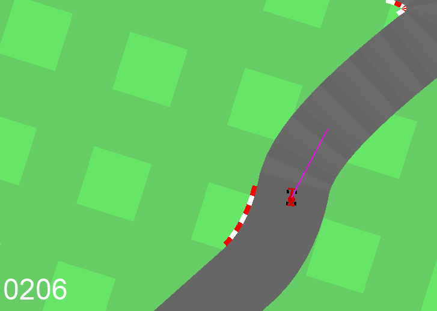

This repository is modified from original open AI gym repository and it is focusing on car_racing simulator.
Car_racing is modified for low friction autonomous driving with evolution strategy training.
original gym repository https://github.com/openai/gym.git

Pic1. One direction input

Pic2. Three direction inputs

Current status:

Low friction added

Neural network class added (modified from: Jason Brownlee on November 7, 2016 in Code Algorithms From Scratch, https://machinelearningmastery.com/implement-backpropagation-algorithm-scratch-python/)

Center point offset and angle offset measures added

Mutation to Neural Network added

Curve steepness input added

Neural network controller added

Evolution strategy training added

Track saving added

Possibility to add the number of network inputs, create training data for cloning networks, train with TensorFlow and swap trained weights to Car NN class added

Curve steepness divided into two inputs

Tyre slipping input added

Currently using one direction input